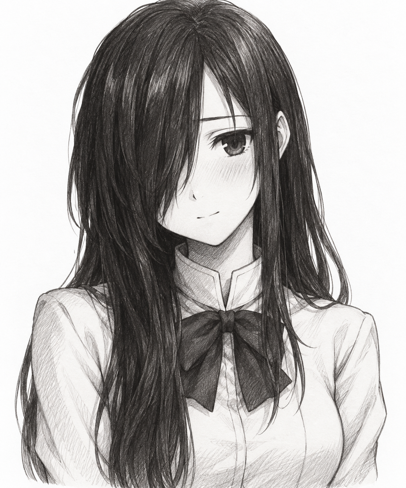
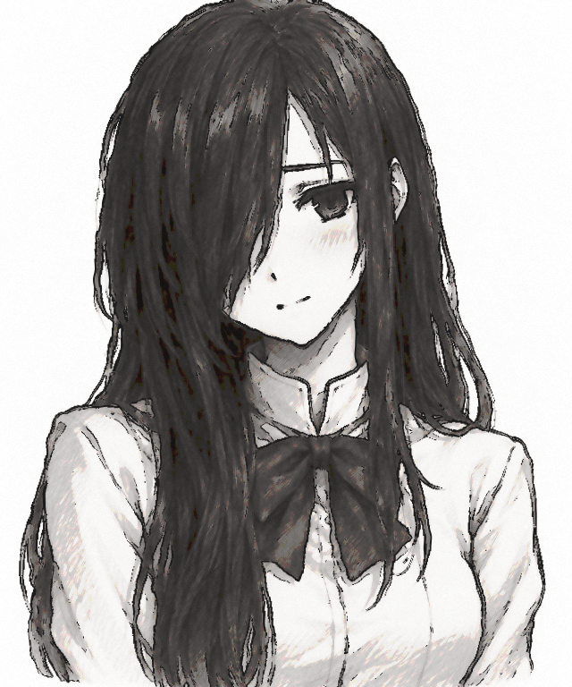

# pikupiku

Turn a still image into a looping **line-boil GIF**: the colored image stays still while a few pencil-outline variations cycle around its contours. Written in C11 with a numbered terminal interface and an optional CLI for batch jobs.

## Before and after

| Input portrait | Rendered line boil |
| --- | --- |
|  |  |

Reference settings: **strength 2 · 5 drawings · 6 fps · 640 px wide**.

```sh
./pikupiku docs/reference/hanako-input.png hanako.gif --width 640 --strength 2 --frames 5 --fps 6
```

The input is an AI-generated fan-art portrait of Hanako Ikezawa from *Katawa Shoujo*, created for this demonstration. The GIF was produced by this renderer. It is not official game artwork. [Reference details](docs/reference/README.md).

## Start with the terminal interface

Requirements: Linux or macOS, a C11 compiler, Make, and FFmpeg on your PATH.

```sh
# Debian / Ubuntu
sudo apt install build-essential ffmpeg

# macOS (after installing the Xcode command-line tools)
brew install ffmpeg

make
./pikupiku
```

The app opens an interactive menu. Choose a number and press Enter:

1. Browse folders and select an image, or paste its path.
2. Set the destination GIF filename.
3. Choose a preset or edit individual settings.
4. Render, then open the result in your image viewer.

No rendering commands or flags are needed in the TUI. Paths may contain spaces; enter them without shell quotes. Paths are relative to the launch directory, and `~` is not expanded. Settings pages show the allowed range for each value. Save/load a settings file to reuse a configuration; this saves rendering options, not image paths.

```text
PIKUPIKU
Animated pencil contours from a still image

Input:  Choose an image
Output: animation.gif
Strength 1 | 3 drawings | 6 fps

1  Browse for image       2  Enter image path
3  Set output GIF path    4  Adjust settings
5  Choose preset          6  Render GIF
7  Open last result       8  Save settings
9  Load settings          q  Quit
```

`make install` installs the program into `~/.local/bin`. On Linux, `make desktop-install` also adds **pikupiku** to your application menu, so you can launch it without typing a command. A graphical terminal emulator must be installed. On macOS, launch the executable from a terminal; a desktop launcher is not supplied.

## Presets and controls

Presets: **Normal**, **Subtle**, **Strong** (five drawings), **Graphite** (monochrome), and **Off**. Selecting a preset resets all controls to that preset's values.

| Control / CLI flag | Default | Range and purpose |
| --- | --- | --- |
| `--strength` | 1 | 0–2; overall effect, 0 disables line boil and base stylization |
| `--amplitude` | 0.8 | 0–20 output pixels; contour displacement, multiplied by strength |
| `--fps` | 6 | 1–60 held drawings per second |
| `--frames` | 3 | 2–120 distinct drawings |
| `--ink` | 0.58 | 0–1 added contour darkness |
| `--grain` | 1.5 | 0–10 stationary paper grain |
| `--simplify` | 0.32 | 0–1 color quantization blend |
| `--width` | 512 CLI / 640 TUI | 32–2048 pixels; height follows aspect ratio |
| `--levels` | 5 | 2–16 levels per color channel before blending |
| `--threshold` | 48 | 1–255; lower detects finer edges |
| `--noise-scale` | 12 | 2–100 pixels; spacing of contour variations |
| `--pressure` | 0.2 | 0–1 variation in pencil darkness |
| `--seed` | 0 | 0–99999; repeatable pattern selection |
| `--saturation` | 1 | 0–2; 0 is monochrome |
| `--contrast` | 1 | 0.1–3 |
| `--brightness` | 0 | −100 to 100 |
| `--smoothing` | 2 | 0–5 pixels; local smoothing radius |
| `--palette` | 128 | 4–256 GIF colors |
| `--dither` | 0 | 0 none, 1 Bayer |
| `--pingpong` | 0 | 0 forward loop, 1 forward then backward without repeating endpoints |

The three color grading controls apply independently of effect strength. Palette conversion always applies because the output is GIF. GIF timing is rounded to centiseconds, so some frame rates cannot be represented exactly. A ping-pong loop has `2 × frames − 2` frames.

## Optional CLI

```sh
./pikupiku portrait.png result.gif --strength 2 --frames 5 --fps 6
./pikupiku portrait.png graphite.gif --saturation 0 --ink 0.7 --grain 2
./pikupiku portrait.png soft.gif --strength 0.4 --fps 5 --pressure 0.1
./pikupiku --help
```

Output is always GIF, regardless of its filename. Existing files are protected by default; the CLI requires `--overwrite`, and the TUI asks before replacing them. Input and output cannot refer to the same file. Rendering completes in a temporary directory before publishing the output, so decode/encode failures leave existing outputs intact. Output directories must already exist.

## How it works

FFmpeg decodes the first frame of a local image. The C renderer gently smooths and simplifies colors, extracts contours, and resamples only the contour mask with deterministic noise. Each drawing receives slightly different contour positions and pencil pressure; the underlying character never sways or deforms. FFmpeg encodes a shared-palette looping GIF.

This is a procedural effect, not a generative redraw or an exact recreation of any game's artwork. Thin or low-contrast linework may need a lower edge threshold. Heavily textured images can produce more contour activity. Alpha is flattened by the decoder; transparency is not preserved. GIF output is limited to 256 colors. Scaled images taller than 4096 pixels are rejected.

## Development

```sh
make
make test
```

Tests require Python 3 (standard library only), FFmpeg, and FFprobe. They exercise real encoding, deterministic output, monochrome mode, zero-strength frames, ping-pong loops, invalid settings, file protection, and a complete TUI render through a pseudo-terminal.

- `src/renderer.c`: image processing, argument validation, FFmpeg process handling, output publication
- `src/tui.c`: interactive file browser, presets, option editing, settings files
- `src/main.c`: TUI / CLI entry point
- `tests/make_fixtures.py`: optional original sample illustration generator (Pillow)

The main reference is the Hanako fan-art example above. Original synthetic fixtures are also included for testing. Personal portraits and other local renders are excluded from the repository.

## License

MIT. This is an independent project, not affiliated with Wiggly Paint or OMORI. FFmpeg is a separate dependency under its own license.
